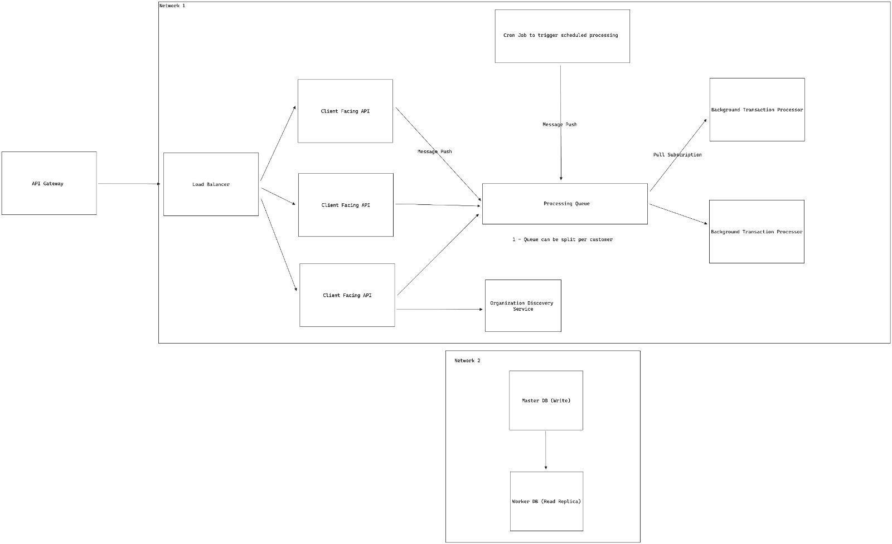

## Running the Application

To run the application, run the following commands:

```bash
docker-compose up --build
```

After running the commands, the application will be available on http://localhost:8080. As it's running in development,
the Swagger interface for interacting with the endpoints will be available.

- The environment variables are configured with defaults for running the application easily. Securing the secrets and
  environments correctly is discussed in the [Secrets and Environment Variables](#secrets-and-environment-variables)
  section.

## Authentication

The technology used for authentication was plain JWT, which is supported by .NET. The choice of having non-expirable
tokens was made on the assumption that application will only involve backend-to-backend communication, so the tokens act
only as an API Key capable of carrying additional information. The capability of generating multiple tokens with
specific authorization claims is a future improvement.

If the application is ever consumed by a client application (Mobile APP, Web application), the token should have
expiration set.

The flow for authenticating in the application is:

- Register a new organization using the `/organization/register` endpoint, passing in a unique name for your
  organization.
- Store the `id` and `secretKey` returned on the response payload.
- Call the `/organization/authenticate` endpoint passing the following payload:

  ```json
  {
    "orgId": id,
    "orgSecretKey": secretKey
  }
  ``` 

- Store the response, this is your JWT token.
- Pass the token in any requests that requires authorization in the headers, with the following
  format: `"Authorization": "Bearer {JWT_TOKEN}"`

## Implementation Decisions

- An organization concept was created to represent specific customers. In a real world setting, each organization (
  customer) would likely use a different Database to achieve multi-tenancy and keep data fully segregated, mitigating
  security concerns.

- The transaction was assumed to be instant, so there are 4 possible statuses:
    - `Created`: Initial status when a call to Create Transaction is made.
    - `Approved`: Transaction was completed successfully, funds have been moved from the Payer to Payee.
    - `Failed`: It was not possible to complete the transaction, might be due to lack of funds or a provider error.
    - `Cancelled`: Indicates that a transaction should not be processed anymore.
- A `Scheduled` status could be added for scheduling transactions, with a cron-job querying for scheduled transactions
  and
  putting them into the processing queue when the scheduled time arrived.
- Cancellation is a synchronous process, marking the transaction as cancelled to avoid it from being processed.
- Cancellation can only happen for transactions in the `Created` status.
- Idempotent request handling for creating transactions.
- Unit tests implemented in the controller layer.
- The `Amount` and `Fee` for the `Transaction` were implemented as Integers to avoid floating point numbers. The unit is cents of dollar. 

## Future Improvements

- Distributed Lock to prevent race condition when cancelling a transaction that may be processing.
- Distributed Lock for idempotency checks, discussed in [Idempotency Requests Handling](#idempotency-requests-handling).
- Improve Observability layer with Logging and distributed tracing, employing a observability service like Elastic and
  Prometheus + Grafana.
- Separate business-logic from the API Interface layer (Controllers), this improves testability and allows different
  protocols to be implemented with minimal code changes, like adding support for Grpc. A Use-cases architecture could be
  used.
- Increase test coverage.
- Improve API Schemas.
- Fire webhooks for status updates on async transaction processing 

## Secrets and Environment Variables

For security purposes, in production I would employ a service like **Doppler** for injecting the environment variables
locally, to keep any sensitive data away from the host computer, and localized in the containers.

## Same Process for Queue processing

Using the same process for queue processing leads to some strange code, as seen in the Program.cs file.
The best practice would be to use two different processes, one that only publishes messages and the other that only
consume messages. With the implemented way, it can still work and be scalable if the scalability is defined by HTTP
Latencies or queue size. But that would always scale both the publisher and the consumer, as they live currently in a
monolith application.

## Idempotency Requests Handling

One of the solutions for guaranteeing idempotency between requests is expecting an idempotency key to be provided by the
API user, giving him control over when a request should not be executed twice. Generally, what happens is that when
receiving a request, if an idempotency key is present, the database or a cache is checked against that key, and if
found,
the existing object is returned, or an error, depending on the implementation.

The problem arises when we have a
distributed system, where each container may handle a request separately and with no specific ordering guarantees. If
two or more requests with the same exact idempotency key are fired, there may be a timeframe that no data is inserted in
the database, and thus all request will pass the key present check and try to execute some piece of code. For payment
transactions, that could mean double spending, which is something we wish to avoid.

One of the ways of removing this
error is guaranteeing request ordering through a queue and a single consumer responsible for deduplicating messages,
which has the downside of introducing a Single Point Of Failure and possible bottleneck in the solution.

If the application is using a SQL
database with ACID guarantees, this job can be offloaded to the database system, where instead of checking if a record
exists, we attempt inserting a transaction, considering that the provided idempotent key has a unique constraint in the
database. The database will then handle locking the index bucket (simplified), and further inserts will return a
error to the API, thus indicating that a request was already made and an idempotent response should be handled in the
API.

- In the case of this task, where we only have one instance for processing, the simplest solution was chosen, but the
  tradeoffs for
  distributed systems were discussed above, and for production-grade code would be employed or further explored for edge
  cases.

## Publishing messages in the endpoint calls _VS_ pooling transactions in processable status

Publishing messages in the endpoint call presents a problem, what if the queue is not online or some network error
happens that prevents a message from being published? Do we keep retrying it, which may case a user timeout, do we
consider the endpoint is only successful if the message is published? How to handle the idempotency if what fails is
the message publishing bit, but the data is inserted in the DB?

In this case, we will consider that the message publishing bit will not fail, but in a production setting the pooling
solution is more robust to failure and also covers the possibility of having scheduled messages in the system.

If pooling is used, we must lock the transaction row in the DB or using a distributed lock with some shared storage to
process the transaction, so even if multiple duplicated messages are present in the queue, no duplicated side effects
will occur to that same transaction.

## Data security and encryption

For encrypting sensitive data, if for example the system allowed credit-card payments, I would use an encryption proxy
so
the data was encrypted before reaching the system, keeping user sensible information safe. When the data needed to be
used, it would be decrypted and processed in a safe environment. A solution
like [Evervault](https://evervault.com/solutions/pci) could be employed to achieve that.

## Scalability and High Availability



Regarding scalability, the above diagram gives a high-level overview of what the system could look like, the API Gateway
should be able to handle authorization and authentication, to avoid processing requests at the application level that
might be rejected. The Gateway also act as a internal service aggregator, if a
Microservice architecture is used and there are multiple different client-facing services with distinct REST APIs.

The Load Balancer can be a Layer 4 or Layer 7 one, depending if long-standing connections are employed in the
application level. It would be responsible for forwarding a requests to a clusters of services, guaranteeing
high-availability and the overall system throughput capacity.

Between the actual user facing API service, there lies a queue service for asynchronous processing of long-running
tasks,
this queue is both used by the APIs and by a cron-job, responsible for fetching data from the DB to process scheduled
transactions, or to catch transactions that may not have been processed due to some error at the point ot creation. The
pool of background workers then uses a pull subscription to the queue, and may scale based on the amount of messages in
the queue.

The Organization service is basically a resolver for the DB and customer specific infrastructure, this allows massive
customers to have their own pool of resources and avoid their large volume from hindering the service availability for
other
customers, it also allows the creation of completely separate data storage layers, if required for compliance.

The Database infrastructure should be in a separate private network, for security reasons, and is assumed to be
reachable by all services.

The option of implementing this as a monolith or microservices is up to the team, but initially I would recommend the
monolithic approach as it makes debugging and creating tooling much easier, with a more straightforward workflow. If
performance issues are identified via monitoring with Observability tools, parts of the system can then be separated in
their own services.